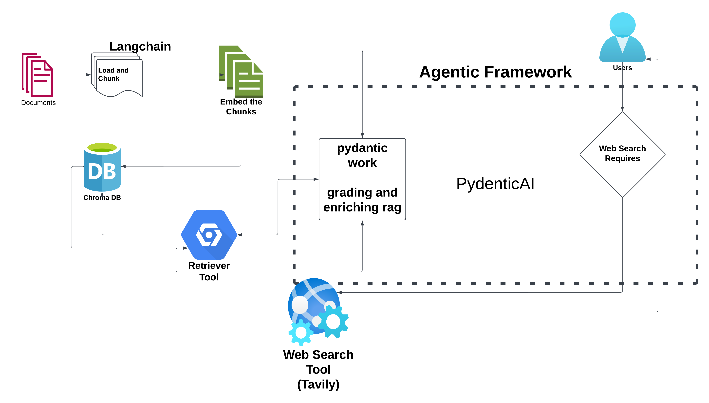

# Agentic RAG System with Self-Grading and Web Search 🔍

A Colab-based implementation of an intelligent search system that combines Retrieval-Augmented Generation (RAG) with self-grading capabilities and web search integration using Pydantic-AI.

## 🌟 Features

- **RAG Implementation**: Uses LangChain and ChromaDB for document retrieval
- **Self-Grading System**: Automatically evaluates responses on relevancy, faithfulness, and context quality
- **Web Search Integration**: Tavily-powered web search for knowledge augmentation
- **Type-Safe Architecture**: Built with Pydantic-AI for robust implementation
- **Multiple LLM Support**: Compatible with both Groq and OpenAI models

## 🔧 Technical Stack

- Python 3.x
- Pydantic-AI
- LangChain & LangChain Community
- ChromaDB
- Sentence Transformers
- Groq LLM (llama-3.3-70b-versatile)
- OpenAI GPT-4
- Tavily API
- HuggingFace Embeddings (all-MiniLM-L6-v2)



## 📋 Prerequisites

```bash
- Google Colab account
- Groq API key
- OpenAI API key
- Tavily API key
```

## 🚀 Installation

Run these commands in your Colab notebook:

```python
# Install required packages
!pip install pydantic-ai
!pip install nest_asyncio
!pip install devtools
!pip install 'pydantic-ai-slim[openai,groq,logfire]'
!pip install tavily-python
!pip install -qU langchain
!pip install -qU langchain_community
!pip install -qU sentence_transformers
!pip install -qU langchain_huggingface
!pip install pypdf
!pip install chromadb
```

## 🔑 API Key Setup

```python
from google.colab import userdata
import os

os.environ["OPENAI_API_KEY"] = userdata.get('OPENAI_API_KEY')
os.environ["GROQ_API_KEY"] = userdata.get('GROQ_API_KEY')
```

## 📁 System Components

1. **Document Processing**
```python
from langchain.document_loaders import PyPDFLoader
from langchain.text_splitter import RecursiveCharacterTextSplitter

loader = PyPDFLoader("your_document.pdf")
documents = loader.load()
split_docs = RecursiveCharacterTextSplitter(
    chunk_size=500, 
    chunk_overlap=50
).split_documents(documents)
```

2. **Vector Store Setup**
```python
from langchain_community.vectorstores import Chroma
from langchain_community.embeddings import HuggingFaceEmbeddings

embedding = HuggingFaceEmbeddings(
    model_name="sentence-transformers/all-MiniLM-L6-v2"
)
vectorstore = Chroma.from_documents(
    documents=split_docs,
    embedding=embedding,
    persist_directory=persist_directory,
    collection_name="your_collection"
)
```

3. **Agent Configuration**
```python
from pydantic_ai import Agent
from dataclasses import dataclass

@dataclass
class Deps:
    question: str | None
    context: str | None

groq_agent = Agent(
    groq_model,
    deps_type=Deps,
    retries=2,
    result_type=str,
    system_prompt="Your system prompt here"
)
```

## 🔍 Usage Example

```python
# Simple query
query = "What is Fibromyalgia?"
response = groq_agent.run_sync(query)
print(response)

# Parse JSON response
from langchain_core.output_parsers import JsonOutputParser
parser = JsonOutputParser()
parsed_response = parser.parse(response.data)
answer = parsed_response['Answer']
```

## 📊 Response Format

The system returns responses in JSON format with the following metrics:
```json
{
    "Relevancy": "<score 0-1>",
    "Faithfulness": "<score 0-1>",
    "Context Quality": "<score 0-1>",
    "Needs Web Search": "<true/false>",
    "Explanation": "<explanation text>",
    "Answer": "<generated response>"
}
```

## 💡 Features in Detail

### Self-Grading Metrics
- **Relevancy (0-1)**: Measures how well the response answers the question
- **Faithfulness (0-1)**: Evaluates adherence to provided context
- **Context Quality (0-1)**: Assesses completeness and relevance of context

### Web Search Integration
- Automatically determines when web search is needed
- Uses Tavily API for enhanced knowledge retrieval
- Seamlessly combines local and web-based information

## 📈 Cost Tracking

The system tracks token usage:
```python
response.cost()  # Returns Cost(request_tokens, response_tokens, total_tokens)
```

## ⚠️ Limitations

- Requires active internet connection
- API key management in Colab environment
- Token usage costs from LLM providers
- Memory constraints of Colab environment

## 🔮 Future Improvements

- [ ] Enhanced error handling
- [ ] Additional LLM provider support
- [ ] Improved context window management
- [ ] Advanced caching mechanisms
- [ ] Custom evaluation metrics

## 📝 License

This project is open-source and available under the MIT License.

---
Created with 💡 for intelligent document search and analysis